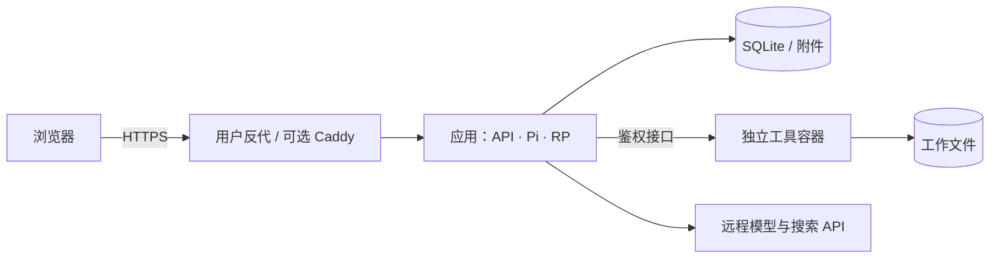

# 架构说明

pi-roleplay 是独立的单用户应用，不需要旧 Roleplay 插件、Harness 服务或父目录依赖。

## 运行结构

生产默认运行 app、tools，网页和 API 共用宿主机的 `127.0.0.1:18767`，由用户反代提供 HTTPS。内置 Caddy 可选，启用后接管 80/443；所选模式随部署配置保存。工具不发布宿主机端口或加入用户反代网络。生产环境不启动 Vite，SQLite 和附件位于本地持久磁盘。

开发时运行本机 Vite 和应用源码，工具仍在专属 Docker 容器中。开发与生产的目录、密钥和 Compose 项目名独立，具体入口见 [本地开发](development.md)。

## 模块职责

| 模块 | 职责 |
| --- | --- |
| `apps/web` | React 界面、Radix 交互、阅读与资料查看、查询缓存 |
| `apps/server` | Fastify API、登录、资料和会话服务、Pi 调度、SQLite、文件存储 |
| `apps/tools` | 文件边界、持久 Bash、超时和取消、输出上限 |
| `packages/rp-core` | 角色资料、世界书、宏、Prompt、变量 / MVU、剧情提交和回放 |
| `packages/protocol` | 前后端与工具服务共享协议 |

领域层不能依赖 React、Fastify 或 Pi。Pi 负责模型请求与 Agent 循环，剧情事实由项目自己的事件与事务维护。实际依赖版本由 `package.json` 和锁文件固定。

## 生成与一致性

消息提交后持久化运行任务。不同会话独立推进，同一会话由数据库约束保证每次只处理一轮，其余输入按顺序等待。每轮冻结实际使用的配置、资料和模型上下文。共享资料按稳定 ID 实时引用，资料编辑影响下一轮，不改写已保存的历史上下文。

实际模型请求共用调度器，默认同时最多 4 个、每个服务连接最多 2 个；主模型、Writer、任务子代理、总结和模型测试使用同一份限额。名额从请求发起占用至完整流结束，包含提供方重试；执行工具和等待用户回答不占用模型名额。某个连接已满时，其他连接仍可继续。同一连接下的不同模型及地址覆盖合计计数。设置可在线调整，降低上限只影响后续放行，不中断已有请求。取消仅作用于指定会话；已提交的剧情不会被撤销。

Chat 模式由 Writer 生成正文，父模型按协议提交；Agent 模式可以读取资料、执行工具和安排任务子代理后提交最终正文。Writer 负责故事正文，父模型负责场外讨论、资料与文件操作。普通过程文本和未提交草稿不自动成为剧情事实。

同一份上下文只接受一个完成的 Writer 结果。父模型审阅后，剧情正文按模式提交；拒绝、澄清等非剧情结果通过 `rp_reply({"useWriterResult":true})` 原样交付为普通回复，不生成剧情事件、变量变化或回复建议。Writer 保持纯文本协议，由父模型判断结果性质。没有变量变化时省略 `effects` 或传 `[]`，不能用空 `state.update.changes` 或虚构变化凑提交。提供商明确返回 `content_filter` 时终止本轮并保留失败记录。

父代理的请求分为当前系统提示、当前可用工具定义与原生消息历史。系统提示按本轮身份、执行模式、Skills 和会话设定组装；工具定义按本轮配置与权限生成。消息历史从同一故事事件日志投影，保留实际 user、assistant、工具调用与工具结果，再加入本轮输入、附件和冻结资料。历史调用不会重新执行，也不会授予已关闭工具的权限。Chat 的当前输入单独传递，Agent 的完整资料快照及 Writer 的 slot 文档保留各自的组装规则。

消息编辑、删除与重新生成会重建有效历史，原始请求记录保持不变；总结覆盖的完整轮次及引用已失效原文的资料快照不再传给模型。分支把截至分叉点的模型历史保存在自身事件中，可以独立于原会话继续；旧分支在首次使用或删除来源前从原会话当时的记录恢复。原始记录缺失时明确报错，不伪造工具结果。中断留下的无结果工具调用只保留诊断，不重放执行；已完成的工具结果继续作为历史事实。

Writer 与任务子代理的模型由用户配置：会话内的选择优先于全局默认，选择「跟随主模型」时使用该会话的主模型。主 Agent 的单次子代理调用不接受模型覆盖参数。

可选的 [Writer 预置历史](writer-history.md) 在队列任务开始时从版本化 SQLite 设置捕获，只作为每个新 Writer 的原生消息前缀。系统提示独立且在语义上位于最前，历史工具不执行也不授予权限；完整快照与模型请求记入诊断日志，正文产物关联 revision / 摘要。主模型与任务子代理不接收此前缀。

正文、总结、变量变化、引用及回复建议在一个 SQLite 事务中原子提交。启用回复建议时，主模型根据审阅后的最终正文和本轮变量变化，在同一次 `rp_commit_turn` 调用中填写 effects 和 `extensions["rp.reply-options"].options`；不再发起独立模型请求或复制上下文。开关、数量、字数和每条方向进入主模型系统提示词，Writer 与任务子代理不继承选项职责。每轮捕获选项配置，运行中关闭功能也会在提交时丢弃返回的选项。

回复建议默认使用第三人称，每条首次叙述玩家角色时使用其已确定的姓名或明确称呼，后续自然使用代词；建议表达明确的行动意图，并为其他角色或场景留下回应空间。用户填写的方向优先决定对应选项的内容、态度、人称、称呼和对白形式，默认规则只补充未指定的部分，不强行把沉默或纯对白改成动作加对白，也不套用固定的选项类别。玩家 ID 与当前姓名来自本轮冻结的会话角色归属及绑定人设，和最终正文、用户方向一起保留在固定提示词内，不随上下文裁剪丢失。正文提示、工具 schema 和格式纠错共用同一套优先级规则。

正文、变量和引用仍严格校验；选项作为建议内容，由提交边界单独规范化为 `rp.reply-options` v1。缺失、无效或超出提交容量的选项不会触发剧情重试，原因随同一个 `turn.committed` 事件保存，并可在界面或执行记录中查看。界面的失败提示可关闭：当前浏览器标签页按会话记住已关闭的提示，刷新不重复展示，新一轮失败仍会提示；这不修改功能开关或删除诊断。主模型请求失败或取消时仍不提交整轮，已无选项专用的 30 秒超时。重复成功提交返回原事件，不覆盖选项或再次应用 effects。删除、编辑、重生成和分支使建议随所属回复回放或失效。旧日志中的 `reply-options.ready` 仅用于读取历史数据，新生成流程不再写入独立选项或后台维护事件。父代理的完整模型消息用于恢复模型历史；请求副本与子代理内部日志用于诊断，都不代替剧情提交和变量事件。

删除整个会话需要确认当前版本，并等待生成及后台任务结束。会话、消息事件、变量、运行记录、待发输入和侧边栏关联在同一事务中清理；共享资料、附件、工作区文件及独立分支保留。数据库仅保留已删除会话的 ID 和删除时间，防止旧创建请求重放后重新生成该会话。删除前的备份仍包含当时的数据。

启动时进行版本化数据库迁移。旧的进行中任务标记为中断，不自动重放模型或文件副作用；尚未开始的排队任务可继续调度。

设置按功能归属维护：快捷回复、回复建议和任务子代理各自保存启用状态；消息头像、变量卡片与对白高亮属于阅读偏好。资料是否参与生成由会话绑定决定；变量维护和 MVU 兼容由每个会话自己的配置决定，暂停维护保留已有值与历史。旧的全局功能开关在偏好设置 v8 迁移时转换为对应配置，停用的资料转为会话取消绑定；迁移通过追加事件完成，并与偏好更新一起提交，不改写旧事件或删除共享资料。

## 执行与存储边界

应用管理数据库、原始附件、头像、背景与加密凭证；工具管理故事工作目录。工具容器只能访问工作目录、只读附件、只读 Skills 和自身鉴权令牌。它不获得应用数据库、Cookie 加密密钥、模型密钥或 Docker socket。

生产容器使用非 root 用户、只读根文件系统、受限临时目录及资源上限。不同故事共享工具容器；命名工作区和分支可共享文件，这不构成租户隔离。项目不提供多用户授权体系。

应用在发起工具请求前协调工作区访问：最多 8 个请求同时进入工具服务；独立目录及兼容读取可并行，重叠目录的 Bash/写入与其他访问按顺序进行。等待中的写入也会阻止后来的重叠读取，避免长期饿死；取消等待中的工具不会发起远程操作。工具服务确认取消时等待命令结束、释放目录锁，随后才放行下一次访问。

管理员密码用于登录，网页保存的模型和搜索密钥加密存储；加密根密钥位于独立的 `session_key` 文件。备份包含数据库和工作文件，配置与密钥需单独保存。

## 运维边界

部署入口先检查空闲状态，再关闭新写入并冷备份。更新先构建独立镜像，备份后切换并等待健康检查。启动失败时保留升级前备份和旧镜像信息，不把旧程序直接指向已迁移数据库。

完整操作和限制见 [部署说明](deployment.md)，公开文件与素材来源见 [开源检查](open-source.md)。
